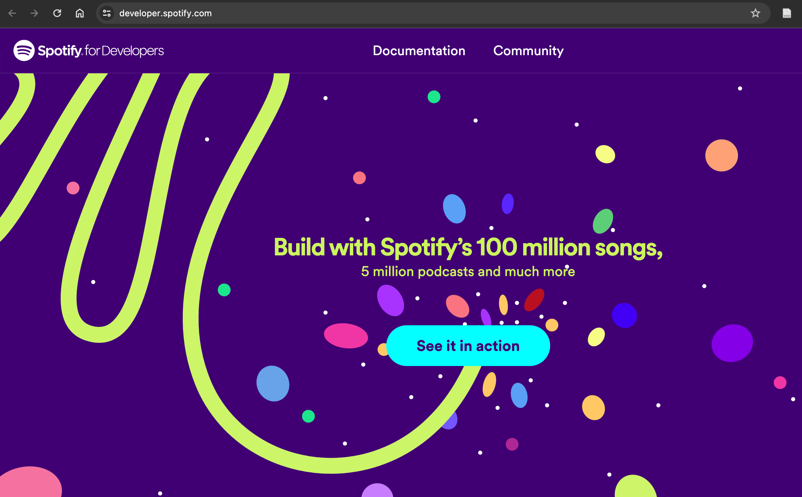
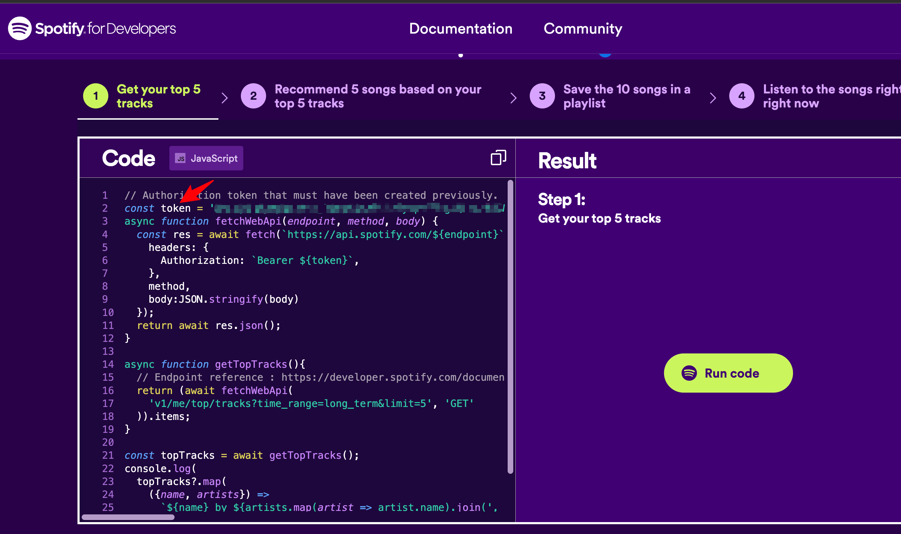

# one-click-netease-spotify

Oneclick to import all your playlists from Netease Music to Spotify.

一键导入你的所有网易云音乐歌单到 Spotify

> Chinese below | 中文说明请往下翻 ↓↓↓

## Step by step instruction

Firstly, clone the project to your local machine and install packages.

```bash
git clone https://github.com/noahwo/one-click-netease-spotify.git
cd one-click-netease-spotify
npm insall
```

You can start up the app by:

```bash
node app.js
```

Then rename `example.env` to `.env`, check your courtry code from https://en.wikipedia.org/wiki/ISO_3166-1_alpha-2, and fill them in the `.env` file.

for example,

```bash
export COUNTRY_CODE='US'
```

### Netease Music side

#### API service hosting

You need to host the NeteaseMusic API service up, follow the instructions from this project [neteasecloudmusicapi](https://gitlab.com/Binaryify/neteasecloudmusicapi). Documentation is available [here](https://binaryify.github.io/NeteaseCloudMusicApi). (Only Chinsese version provided)

Put the API service address in the `.env` for the variable `NE_API`. e.g., `export NE_API=http://localhost:3000`.

#### Get your Netease Music user id

Login to your Netease Music account in **broswer**, and go to your profile page. The user id is in the URL, e.g., `http://music.163.com/#/user/home?id=12345678`, the user id is `12345678`.

Put the user id in the `.env` for the variable `USER_ID`. e.g., `export USER_ID=12345678`.

Count how many playlists you have/you wanna import, which is gonna be used in the program.

> P.S. playlists importing would be done following the order shown in the page. Importing by default includes both the playlists you created and collected.

### Spotify side

I did not figure out how to get the Authorization Code with PKCE Flow nor Implicit Grant which are the only ways to manipulate your own account, so there is a way to work around at the time through the code example given by the official.

#### Get your Spotify Developer account & access token

But anyway you need to login to [Spotify Developer page](https://developer.spotify.com/) first.
you can enter this page by clicking the up-left corner icon **[Spotify for Developers]**. The click 'See it in action'



The `token` variable is what we want, copy the full string to `.env`, e.g., `ACCESS_TOKEN='******your-token-string******'`.

> NOTE: This token expires in 1 hour, you need to refresh it manually.

### In the program

In the function `fetchNeteasePlaylists(USER_ID)`, you can edit `limit` and `offset` in the URL. `limit` (by default 30) determines how many playlists you wanna import, and `offset` (by default 0) determines the starting point (#th of your all lists) of the importing.
e.g.,

```javascript
const response = await fetch(
  `${NE_API}/user/playlist?uid=${USER_ID}&limit=30&offset=0`
);
```

Around the code below you can modify the filter condition to exclude some playlists you don't wanna import. For me, I already imported Favorite music from Netease, and labeled previously imported playlists with a "-" prefix.

> P.S. Due to the 300 character limit of the playlist description in Spotify, the failed song transitions info in playlist description may not be complete, you can check terminal output for missing information. I would recommend each time you try to import only 3~5 playlists due to their strict limit (cooling time can be up to 20 hours), by toggling the `limit` and `offset` in the URL [here](#Intheprogram).

e.g.,

```javascript
filteredPlaylist = await simplifiedPlaylist.filter(
  (item) => !item.name.startsWith("-") && !item.name.endsWith("喜欢的音乐")
);
```
